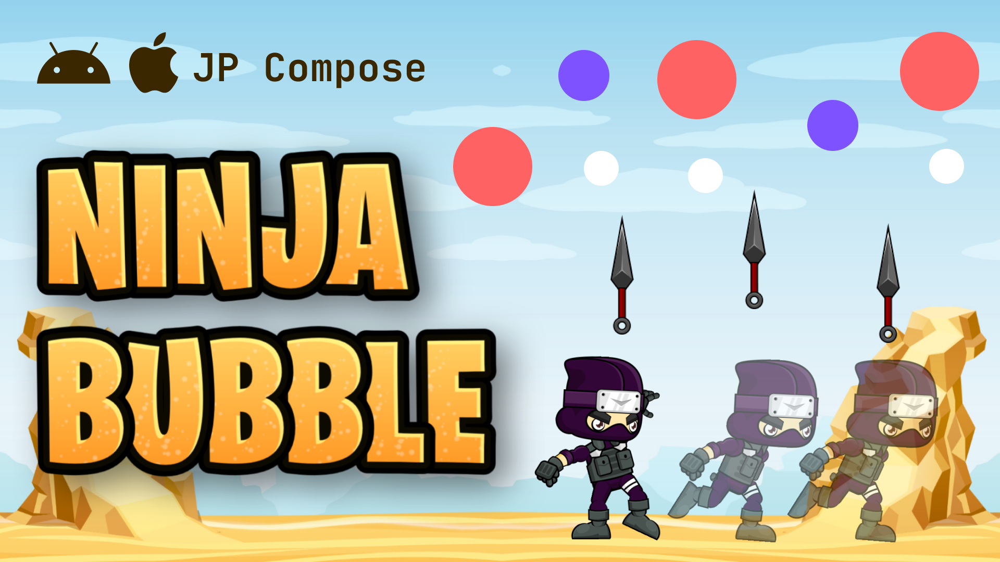

# Ninja Bubble - A Jetpack Compose Game (Kotlin Multiplatform)

<p align="center">
  
</p>

## 🏆 About the Game
Ninja Bubble is an engaging and interactive game developed using **Jetpack Compose** in **Kotlin Multiplatform**. Players control a ninja character, aiming to hit falling targets with thrown weapons while avoiding game-over conditions.

## 🎮 Features
- **Smooth Animations**: Leveraging Jetpack Compose for fluid character and object movements.
- **Kotlin Multiplatform Support**: Playable on multiple platforms with a single codebase.
- **Dynamic Difficulty Levels**: The game becomes more challenging as you progress.
- **Collision Detection**: Accurate detection between weapons and targets.
- **Custom Sprites**: Unique designs for characters and weapons.
- **Audio Effects**: Immersive sound effects enhancing gameplay.

## 🚀 Installation & Running
### Prerequisites
- **Android Studio**: Latest version recommended.
- **Kotlin Multiplatform Plugin**: Ensure it's installed.
- **Gradle 8+**: Required for building the project.
- **Jetpack Compose Compiler**: Necessary for Compose UI.

### Steps to Run
1. **Clone the Repository**
   ```sh
   git clone https://github.com/Abhi95081/NinjaBubble.git
   cd NinjaBubble
Open in Android Studio

# Open in Android Studio

1. **Launch Android Studio**.

2. **Open the cloned project** and allow it to sync all dependencies.

# Run the Game

1. **Choose** an emulator or a physical device.

2. **Click** on Run ▶️ to start the game.

# 🛠️ Technologies Used

- **Kotlin Multiplatform**: Shared codebase for multiple platforms.
- **Jetpack Compose**: Modern UI toolkit for native Android interfaces.
- **Canvas API**: For custom drawings and animations.
- **Coroutines & Animations**: Managing asynchronous tasks and animations.
- **Dependency Injection (Koin)**: For efficient dependency management.
- **Compose Resources**: Handling resources in Compose.

# 🔥 Contributing

Interested in enhancing Ninja Bubble? Contributions are welcome!

1. **Fork the Repository**: Click on the 'Fork' button at the top.
2. **Create a New Branch**: For your feature or bug fix.
3. **Commit Your Changes**: With clear and concise messages.
4. **Push to Your Branch**: Upload your changes.
5. **Open a Pull Request**: Describe your changes and submit.

# 📜 License

This project is licensed under the **MIT License**. Feel free to use, modify, and distribute the code.

# ✨ Developed by Abhishek Roushan
